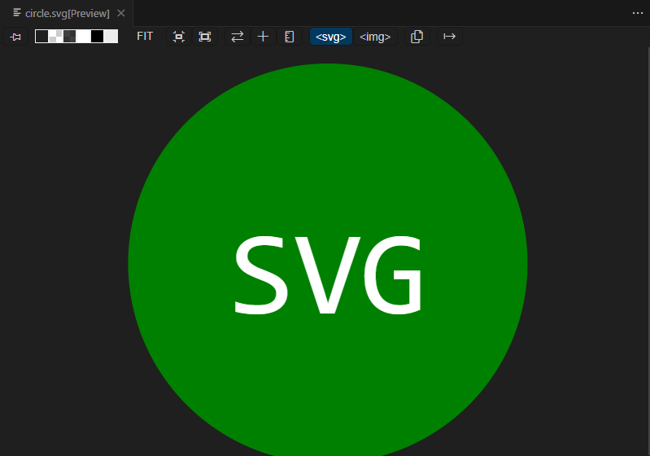

# SVG Logo Maker

This Node.js command-line application allows you to generate SVG logos with customizable text, shapes, and colors. With SVG Logo Maker, you can quickly create simple logos for your projects without the need for graphic design software.

## Installation

To install SVG Logo Maker, follow these steps:

1. Clone this repository to your local machine using Git:

   ```bash
   git clone https://github.com/your-username/svg-logo-maker.git

2. Navigate to the project directory:

3. Install the required dependencies using npm i & npm install inquirer


## Usage
To use SVG Logo Maker, run the following command in your terminal:

# Technologies Used
Node.js: SVG Logo Maker is built using Node.js, a popular JavaScript runtime.

Inquirer.js: Inquirer.js is used to create interactive command-line interfaces in SVG Logo Maker, making it easy to collect user input.

# Acknowledgements
SVG Logo Maker was inspired by the need for a simple tool to create logos for personal projects. Special thanks to the contributors who have helped improve SVG Logo Maker over time.


## NPM Test


## NPM Package Installer 


## NPM Inquirer 


## Node Index.js


## Node Preview of Circle SVG


## Video Link for the Assignment-